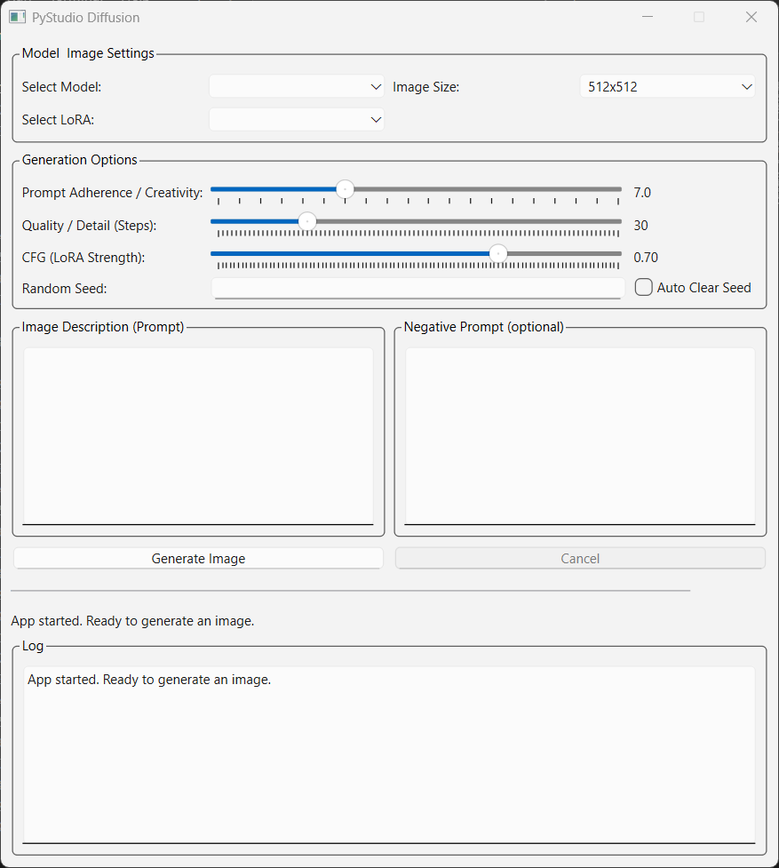

# PyStudio Diffusion



PyStudio Diffusion is a modern, responsive GUI for generating images using local Stable Diffusion and SDXL models. The preferred version uses PySide6 for a sleek, professional interface. A legacy Tkinter version is also included for reference.


## Features
- Local-only model support (no cloud API required)
- Select from multiple models in the `models/` folder (including NSFW/uncensored SD/SDXL models)
- Download verified models and LoRAs from Hugging Face using the built-in downloader GUIs (`getmodels.py` and `getloras.py`)
- Adjustable image size, guidance scale, steps, and LoRA strength
- Prompt and negative prompt input
- Seed control for reproducibility
- LoRA support (download and apply compatible LoRAs, including NSFW/uncensored)
- Save generated images
- Responsive UI (threaded operations)
- Modern PySide6 interface (preferred)
- Legacy Tkinter interface (for reference)


## Requirements
- Python 3.8+
- torch (CUDA recommended for best performance)
- diffusers
- Pillow
- huggingface_hub
- peft
- PySide6

Install dependencies:
```sh
pip install torch diffusers pillow huggingface_hub peft PySide6
```


## Usage
1. Download models and LoRAs:
    - Run `getmodels.py` to download verified SD/SDXL models (including NSFW/uncensored) from Hugging Face. You will need a token key from Hugging Face.
    - Run `getloras.py` to download compatible LoRAs (including NSFW/uncensored) from Hugging Face.
2. Place your Stable Diffusion or SDXL models in the `models/` folder. Each model should have its own subfolder with required files (`model_index.json`, `unet`, `vae`, `text_encoder`, `tokenizer`).
3. Run the app:
    - **PySide6 (preferred):**
       ```sh
       python main.py
       ```
    - **Tkinter (legacy):**
       ```sh
       python main_tk.py
       ```
4. Select a model and LoRA, enter your prompt, negative prompt (if desired), adjust settings, and click "Generate Image".

## License

MIT License

Copyright (c) 2025 QuantumPixelator

Permission is hereby granted, free of charge, to any person obtaining a copy
of this software and associated documentation files (the "Software"), to deal
in the Software without restriction, including without limitation the rights
to use, copy, modify, merge, publish, distribute, sublicense, and/or sell
copies of the Software, and to permit persons to whom the Software is
furnished to do so, subject to the following conditions:

The above copyright notice and this permission notice shall be included in all
copies or substantial portions of the Software.

THE SOFTWARE IS PROVIDED "AS IS", WITHOUT WARRANTY OF ANY KIND, EXPRESS OR
IMPLIED, INCLUDING BUT NOT LIMITED TO THE WARRANTIES OF MERCHANTABILITY,
FITNESS FOR A PARTICULAR PURPOSE AND NONINFRINGEMENT. IN NO EVENT SHALL THE
AUTHORS OR COPYRIGHT HOLDERS BE LIABLE FOR ANY CLAIM, DAMAGES OR OTHER
LIABILITY, WHETHER IN AN ACTION OF CONTRACT, TORT OR OTHERWISE, ARISING FROM,
OUT OF OR IN CONNECTION WITH THE SOFTWARE OR THE USE OR OTHER DEALINGS IN THE
SOFTWARE.
